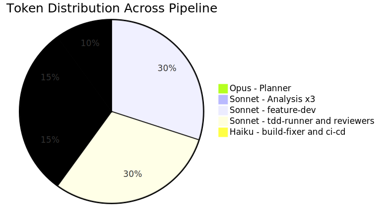

# Motadata NextGen — AI Development Architecture

> Agent-driven frontend development pipeline for React + TypeScript SaaS

---

## 1. Full Pipeline — End to End

---

## 2. Resilience — 7 Failure Mitigations

---

## 3. Cost Strategy by Model

---

## 4. Skills — 26 Skill Files Across 12 Agents

| Category | Skills | Used By |
| --- | --- | --- |
| Foundation | react-typescript, vite, eslint-prettier, sonarqube-compliance | feature-dev, build-fixer, project-scaffolding |
| UI & Design | tailwind-css, shadcn-ui, responsive-design, dark-light-theming, accessibility | feature-dev, design-analyzer |
| State & Data | redux-toolkit, tanstack-query, react-hook-form-zod, rest-api-integration, react-router | feature-dev, planner |
| Security | authentication, rbac, frontend-security | feature-dev, security-reviewer |
| Testing | vitest, react-testing-library, playwright | tdd-runner, e2e-runner |
| DevOps | git-github-cli, github-actions, husky-lint-staged | ci-cd-manager |
| Quality | performance-optimization, error-handling, workflow-pipeline | feature-dev |

---

## 5. Summary Numbers

| Dimension | Value |
| --- | --- |
| Custom agents | 12 |
| Skill files | 26 |
| Pipeline stages | 8 sequential + 1 on-demand |
| Parallel execution points | 2 — Stage 2 and Stage 6 |
| Quality gate hooks | 3 — TeammateIdle, TaskCompleted, PostToolUse |
| Resilience patterns | 7 — one per critical failure type |
| Max active teammates | 5 |
| Test coverage threshold | 80 percent |
| Review cycle limit | 2 — deadlock prevention |
| Circuit breaker limit | 3 attempts — build-fixer |
